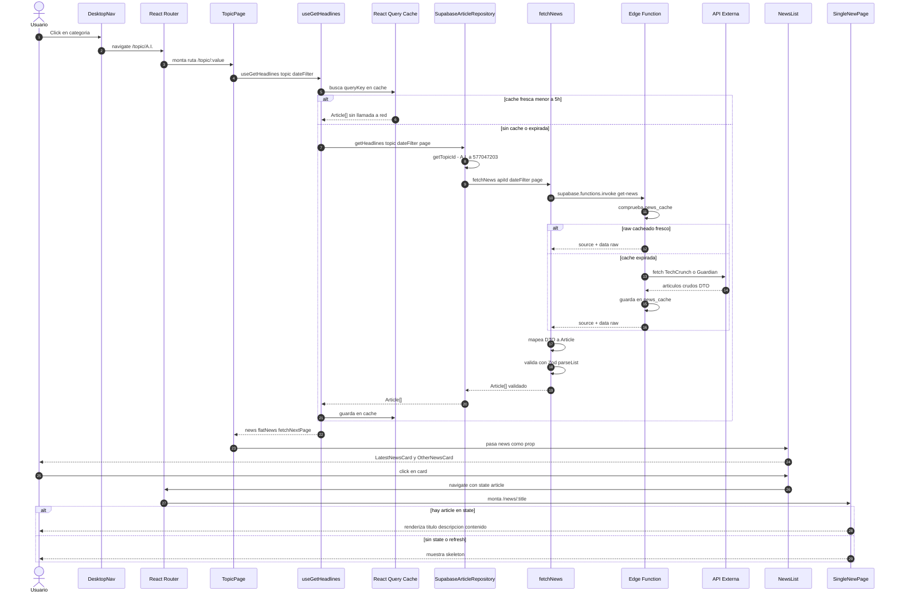
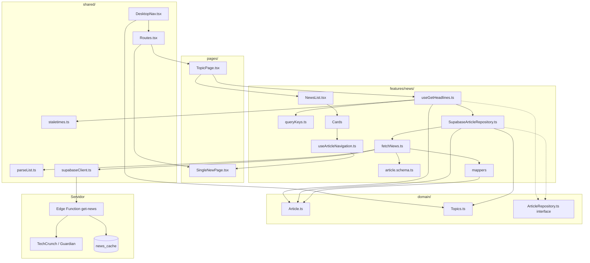
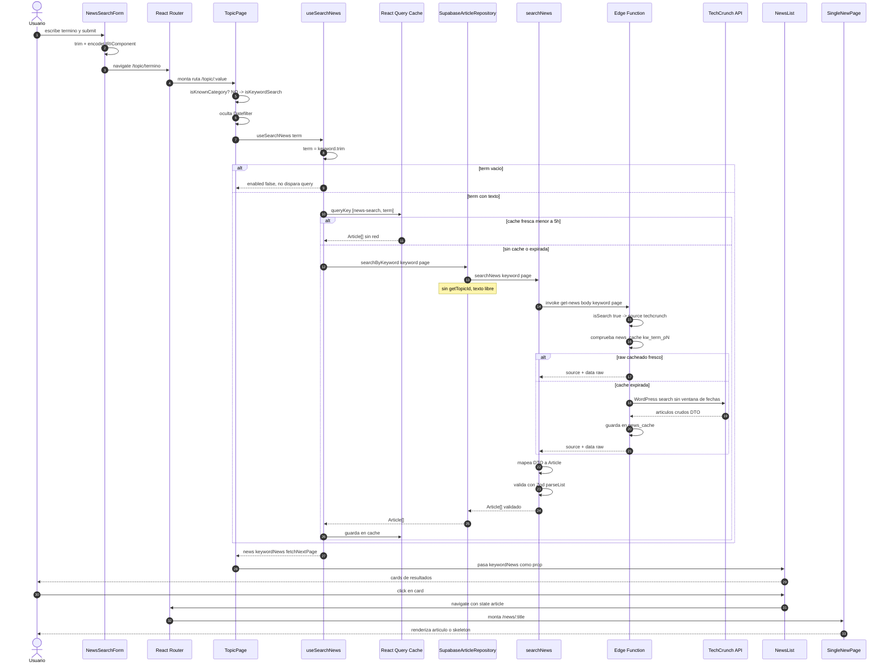
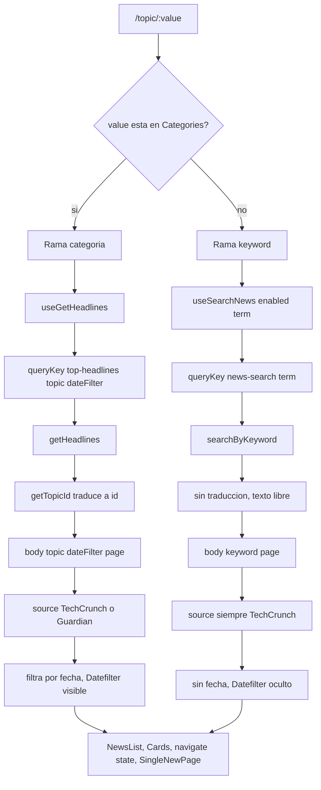

# Flujo de datos - Feature news (ruta useGetHeadlines)

---

## 1. Diagrama de secuencia



---

## 2. Diagrama de capas



---

## 3. Transformacion del dato

```mermaid
flowchart LR
    A["TopicId legible - A.I."]
    B["ApiTopicId - 577047203"]
    C["DTO crudo"]
    D["Article mapeado"]
    E["Article validado Zod"]
    F["flatNews React Query"]
    G["Article en router state"]
    H["HTML renderizado"]

    A -->|getTopicId| B
    B -->|Edge + API| C
    C -->|mappers| D
    D -->|Zod schema| E
    E -->|flatMap| F
    F -->|navigate state| G
    G -->|SingleNewPage| H
```



---

# Rama useSearchNews (busqueda por keyword)

La busqueda NO usa una ruta /search propia: reutiliza /topic/:value.
El formulario navega a /topic/termino y TopicPage discrimina si es
categoria conocida o keyword libre.

## 4. Diagrama de secuencia - busqueda



---

## 5. Comparativa de las dos ramas



---

## Notas de la rama de busqueda

- **Origen distinto**: la categoria nace de un NavLink del nav; la busqueda nace
  del formulario NewsSearchForm en el Header. Ambas terminan en /topic/:value.
- **El discriminador vive en TopicPage**: isKnownCategory compara value contra
  Object.values(Categories). Si no coincide, se trata como keyword. Riesgo:
  buscar literalmente "Smartphones" o "A.I." cae en la rama de categoria.
- **enabled: term.length > 0**: TopicPage monta ambos hooks siempre; este guard
  evita que useSearchNews dispare una query vacia cuando estamos en una categoria.
- **Sin traduccion de dominio**: searchByKeyword NO usa getTopicId; el termino va
  como texto libre al servidor (a diferencia de la rama de categoria).
- **Servidor**: en busqueda la Edge Function siempre usa TechCrunch (endpoint
  WordPress con search=), sin ventana de fechas, y cachea con clave kw_term_pN.
- **La cola es identica** a la rama de headlines: NewsList, cards, navegacion por
  state y SingleNewPage.
- **encodeURIComponent**: el formulario codifica el termino antes de navegar, asi
  un termino con / (ej. iOS 18/19) no rompe la ruta. useParams lo decodifica.
- **/search eliminada**: la antigua pagina SearchResults era codigo muerto y se
  retiro; la busqueda funciona reutilizando /topic/:value.
```
