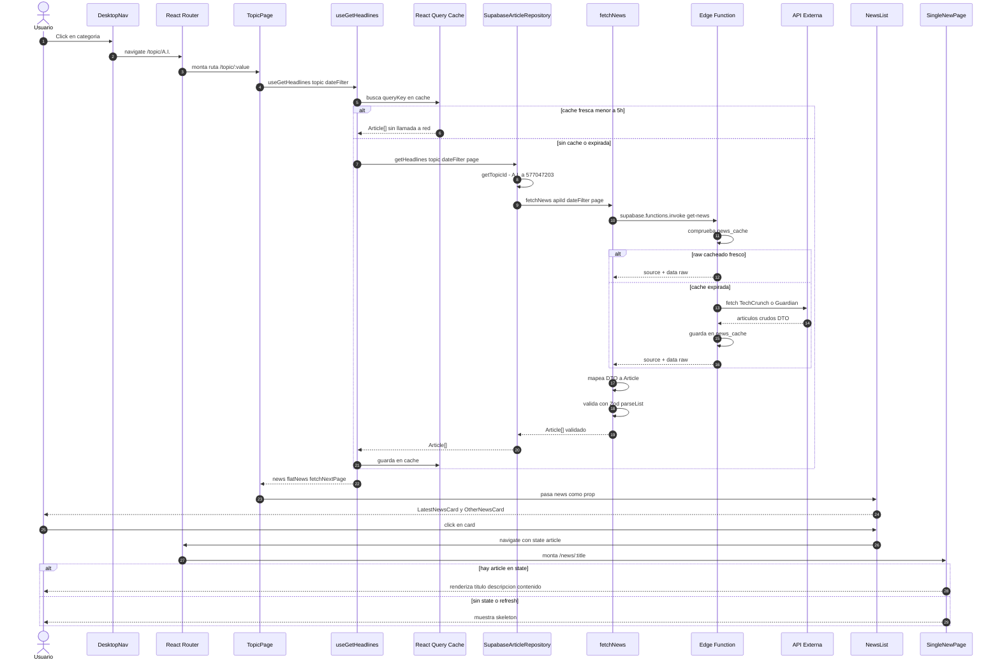
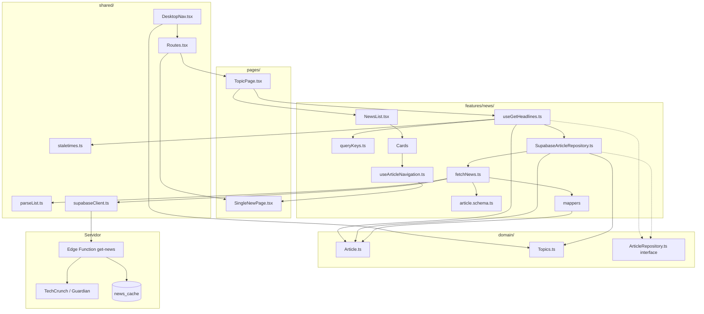

# Flujo de datos - Feature news (ruta useGetHeadlines)

---

## 1. Diagrama de secuencia

```mermaid
sequenceDiagram
    autonumber
    actor U as Usuario
    participant Nav as DesktopNav
    participant RR as React Router
    participant TP as TopicPage
    participant Hook as useGetHeadlines
    participant QC as React Query Cache
    participant Repo as SupabaseArticleRepository
    participant Fetch as fetchNews
    participant Edge as Edge Function
    participant Ext as API Externa
    participant List as NewsList
    participant SNP as SingleNewPage

    U->>Nav: Click en categoria
    Nav->>RR: navigate /topic/A.I.
    RR->>TP: monta ruta /topic/:value
    TP->>Hook: useGetHeadlines topic dateFilter

    Hook->>QC: busca queryKey en cache
    alt cache fresca menor a 5h
        QC-->>Hook: Article[] sin llamada a red
    else sin cache o expirada
        Hook->>Repo: getHeadlines topic dateFilter page
        Repo->>Repo: getTopicId - A.I. a 577047203
        Repo->>Fetch: fetchNews apiId dateFilter page
        Fetch->>Edge: supabase.functions.invoke get-news
        Edge->>Edge: comprueba news_cache
        alt raw cacheado fresco
            Edge-->>Fetch: source + data raw
        else cache expirada
            Edge->>Ext: fetch TechCrunch o Guardian
            Ext-->>Edge: articulos crudos DTO
            Edge->>Edge: guarda en news_cache
            Edge-->>Fetch: source + data raw
        end
        Fetch->>Fetch: mapea DTO a Article
        Fetch->>Fetch: valida con Zod parseList
        Fetch-->>Repo: Article[] validado
        Repo-->>Hook: Article[]
        Hook->>QC: guarda en cache
    end

    Hook-->>TP: news flatNews fetchNextPage
    TP->>List: pasa news como prop
    List-->>U: LatestNewsCard y OtherNewsCard

    U->>List: click en card
    List->>RR: navigate con state article
    RR->>SNP: monta /news/:title
    alt hay article en state
        SNP-->>U: renderiza titulo descripcion contenido
    else sin state o refresh
        SNP-->>U: muestra skeleton
    end
```

---

## 2. Diagrama de capas

```mermaid
flowchart TD
    subgraph domain["domain/"]
        Article["Article.ts"]
        Topics["Topics.ts"]
        Port["ArticleRepository.ts interface"]
    end

    subgraph shared["shared/"]
        Nav["DesktopNav.tsx"]
        Router["Routes.tsx"]
        Stale["staletimes.ts"]
        ParseList["parseList.ts"]
        Supa["supabaseClient.ts"]
    end

    subgraph pages["pages/"]
        TopicPage["TopicPage.tsx"]
        SingleNewPage["SingleNewPage.tsx"]
    end

    subgraph feature["features/news/"]
        Hook["useGetHeadlines.ts"]
        ArtNav["useArticleNavigation.ts"]
        Keys["queryKeys.ts"]
        RepoImpl["SupabaseArticleRepository.ts"]
        FetchNews["fetchNews.ts"]
        Schema["article.schema.ts"]
        Mappers["mappers"]
        NewsList["NewsList.tsx"]
        Cards["Cards"]
    end

    subgraph server["Servidor"]
        Edge["Edge Function get-news"]
        Ext["TechCrunch / Guardian"]
        Cache[("news_cache")]
    end

    Nav --> Topics
    Nav --> Router
    Router --> TopicPage
    Router --> SingleNewPage
    TopicPage --> Hook
    TopicPage --> NewsList
    Hook --> RepoImpl
    Hook --> Keys
    Hook --> Stale
    Hook -.-> Port
    RepoImpl -.-> Port
    RepoImpl --> Topics
    RepoImpl --> FetchNews
    FetchNews --> Supa
    FetchNews --> Mappers
    FetchNews --> Schema
    FetchNews --> ParseList
    Supa --> Edge
    Edge --> Cache
    Edge --> Ext
    NewsList --> Cards
    Cards --> ArtNav
    ArtNav --> SingleNewPage
    Hook --> Article
    RepoImpl --> Article
    Mappers --> Article
```

---

## 3. Transformacion del dato

```mermaid
flowchart LR
    A["TopicId legible - A.I."]
    B["ApiTopicId - 577047203"]
    C["DTO crudo"]
    D["Article mapeado"]
    E["Article validado Zod"]
    F["flatNews React Query"]
    G["Article en router state"]
    H["HTML renderizado"]

    A -->|getTopicId| B
    B -->|Edge + API| C
    C -->|mappers| D
    D -->|Zod schema| E
    E -->|flatMap| F
    F -->|navigate state| G
    G -->|SingleNewPage| H
```
